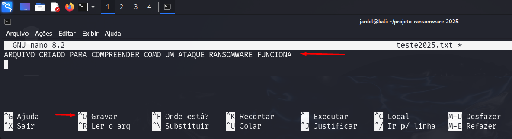
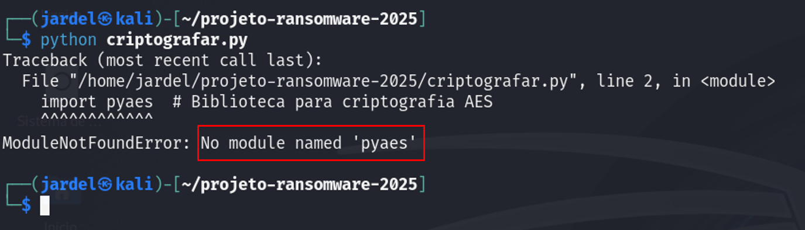

# Projeto: como criptografar/descriptografar (ataque Ransomware) utilizando linguagem Python

## Aviso Importante
Este guia é destinado exclusivamente para fins educacionais ou testes autorizados. A utilização para atividades ilícitas acarretará em sérias consequências legais.

### Ferramentas necessárias

Para esta simulação, você precisará do sistema operacional abaixo instalado e configurado em um ambiente de teste virtual:

- *Kali Linux*: Sistema operacional especializado em testes de segurança e penetração. No site https://www.kali.org/ será possível efetuar download do arquivo ISO para instalação manual ou arquivo de imagem pré-configurada para máquinas virtuais.

### Passo a Passo

**1. Criando a pasta e os arquivos necessários para o teste**  
Para este teste, criaremos uma pasta e três arquivos no Kali Linux conforme passos descritos a seguir:
- Abra o terminal;

  

  

- Digite a linha de comando: **mkdir projeto-ransomware-2025** (*__Nota:__* escolha um nome de pasta de sua preferência) e pressione a tecla ENTER para criar a pasta;

  

- Digite a linha de comando: __cd projeto-ransomware-2025__ e pressione a tecla ENTER para acessar a pasta criada;  

  

- Digite a linha de comando: __touch teste2025.txt__ (*__Nota:__* escolha um nome do arquivo de txt de sua preferência, mas lembre-se de informar o mesmo nome nos códigos Python que serão criados mais adiante) e pressione a tecla ENTER para criar o arquivo de texto;

  

- Repita a operação para criar os arquivos **criptografar.py** e **descriptografar.py**:

  

  

- Para listar os arquivos criados na pasta, utilize o comando **ls** no terminal:

  

**2. Editando os arquivos criados**  
Após a criação dos arquivos na etapa anterior, vamos editá-los para que possamos realizar o teste. Ainda no terminal do Kali Linux, execute os passos descritos a seguir:  
- Digite a linha de comando: **nano teste2025.txt** (caso tenha alterado o nome do arquivo TXT substitua-o na linha de comando) e pressione a tecla ENTER;

  

- Na tela de edição, digite a mensagem de sua preferência e em seguida, **pressione as teclas CTRL+O** para salvar o arquivo, **pressione a tecla ENTER** e por fim, **pressione as teclas CTRL+X** para fechar a edição do arquivo;

  

  

- *__Nota:__* para visualizar o conteúdo do arquivo, **digite cat <<nome_do_arquivo>>** e pressione a tecla ENTER:

  

  

- Repita a operação para editar os arquivos criptografar.py e descriptografar.py;
  - *__Nota:__* para facilitar o processo, utilize os arquivos disponíveis neste repositório.
  - **criptografar.py:**

  

  

  - **descriptografar.py:**

  

  

**3. Realizando testes**  
Para simular um ataque ransomware utilizando os códigos criados, proceda da seguinte forma:  
- No terminal, na pasta onde os arquivos foram criados, digite a linha de comando: **python criptografar.py** e pressione a tecla ENTER;

  

  - Se uma mensagem de erro semelhante à mostrada abaixo for exibida, será necessário instalar a biblioteca PYAES do Python. Para isso, siga as instruções disponíveis no site [installati.one](https://installati.one/install-python3-pyaes-kalilinux/) para instalar a biblioteca necessária.
 

  

- Caso tenha utilizado o código disponível neste repositório, ao executá-lo, uma mensagem similar a abaixo será exibida quando o arquivo for criptografado:

  

- Para validar se o código funcionou, tente visualizar o conteúdo do arquivo TXT (utilize a linha de comando **cat <<nome_do_arquivo>>**). Algo similar ao apresentado abaixo será exibido:

  

- Para descriptografar o arquivo, digite a linha de comando: **python descriptografar.py** e pressione a tecla ENTER;

  

- Caso tenha utilizado o código disponível neste repositório, ao executá-lo, uma mensagem similar a abaixo será exibida quando o arquivo for descriptografado:

  

- Para validar se o código funcionou, tente visualizar o conteúdo do arquivo TXT (utilize a linha de comando **cat <<nome_do_arquivo>>**). Algo similar ao apresentado abaixo será exibido:

  

### Considerações finais
O que foi apresentado neste documento serve apenas para fins de estudo, elucidando como funciona um ataque de ransomware. No entanto, é crucial destacar que a ameaça de ransomware é real e crescente, afetando tanto indivíduos quanto organizações em todo o mundo.  

Ransomware é um tipo de malware que sequestra seus dados, exigindo um resgate para devolvê-los. Esses ataques podem causar um estrago enorme, como perda de dados, interrupção das operações e altos custos financeiros. Além disso, recuperar-se de um ataque de ransomware pode ser um processo demorado e complicado.

Para mitigar esses riscos, é fundamental conscientização sobre tais ameaças e promover as melhores práticas de segurança denntre as quais se destacam:

1. **Educação e Treinamento**: para saber identificar e evitar ataques de phishing, que são uma das principais portas de entrada para o ransomware.

2. **Backup Regular**: Manter backups regulares e atualizados dos dados críticos. Armazenar esses backups em locais seguros e desconectados da rede principal para garantir que não sejam comprometidos em um ataque. Uma boa solução é utilizar backup em nuvem.

3. **Atualizações e Patches**: Mantenha o sistema operacional e softwares atualizados com os patches de segurança mais recentes. Vulnerabilidades em software desatualizado são frequentemente exploradas por atacantes.

4. **Segurança de Rede**: Utilize medidas de segurança robustas, como firewalls, antivírus e sistemas de detecção de intrusão, para proteger a rede contra acessos não autorizados. Por exemplo, em uma rede doméstica, o WPS ativado pode ser uma vulnerabilidade.

5. **Políticas de Senhas**: Adote políticas de senhas fortes e procure sempre utilizar autenticação multifator (MFA) para adicionar uma camada extra de segurança.

